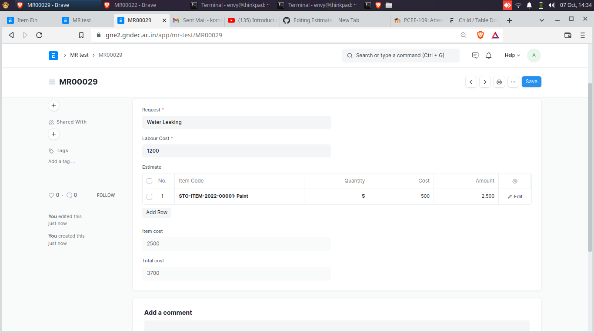

# Estimated Table For SDO

Estimate table is generated by the SDO and further send to the Office incharge to the CMC so that they can get some idea about the required budget for the work.

Estimate table consist of 4 values (Item , Quantity , Cost , Total Cost ).

For Estimate :
 1. Firstly create one child doctype with the name of Estimate and its parent docype would be Maintance request.

      1. User will select the item.
   
         For this we need to link the item doctype with estimate. To link the doctype put the field into estimate doctype but there should be same name. 
   
      2. Put the quantity for the item.
   
         Here SDO will select the quantity manually.
      
      3. Cost will automatically fetched corrosponding to the item.
   
         For cost need to link the valuation rate of each item.
   
     4. Total cost will also automatically come after multipluybg the values of qunatity and cost.
   
         For this required one script which multiply the values. Script is written below -
         
    ``` 
     frappe.ui.form.on("Item Ein", {
	    cost: function(frm,cdt, cdn){
		   calculate_total(frm, cdt, cdn);
	    },
	    quantity: function(frm, cdt, cdn){
		  calculate_total(frm, cdt, cdn);
	    }
     });
     var calculate_total = function(frm, cdt, cdn) {
	    var child = locals[cdt][cdn];
     frappe.model.set_value(cdt, cdn, "amount", child.cost * child.quantity);
     };
     
     frappe.ui.form.on('MR test', {
     validate: function(frm,cdt,cdn) {
        set_item_cost(frm);
     }
     });

    function set_item_cost(frm) {
    var doc = locals[frm.doc.doctype][frm.doc.name];
    var item_cost = 0;
    $.each(doc.estimate, function(i, d) {
        item_cost += flt(d.amount);
    });

    frm.set_value("item_cost",item_cost);
    }

    frappe.ui.form.on('MR test', {
    refresh(frm){
        frm.doc.total_cost = frm.doc.labour_cost * frm.doc.item_cost;
        refresh_field("total_cost");
     }
     });
      ```
      
  ##### Put above scripte into client script of the estimate doctype then enable the script.
  
  ####  Estimate table has been generated. It looks something like below given.
  
   
